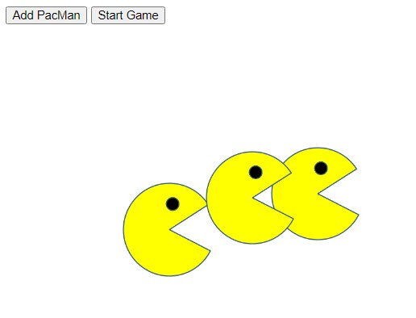

# Pacmen
Create and Move Pacmen

  

## <ins>What it does

Uses JS code that creates Pacman each time a button is clicked in conjuction with HTML.

## <ins>How to Run

Load page and click the Add PacMan button in the top left hand corner to add a pacman then click the Start Game button to make them move.  Add as many Pacmen as you like and click the Start Game button to make them move faster.  Reload browser to restart from zero Pacmen.

  

## <ins>Future improvements

Future improvements would be to add a switch statement and random feature to add different size and color Pacmen with the button Click and add a reset button instead of having to reload the browser to reset the game.

## <ins>License

MIT License

Copyright (c) 2022 Jeremy Duval

Permission is hereby granted, free of charge, to any person obtaining a copy
of this software and associated documentation files (the "Software"), to deal
in the Software without restriction, including without limitation the rights
to use, copy, modify, merge, publish, distribute, sublicense, and/or sell
copies of the Software, and to permit persons to whom the Software is
furnished to do so, subject to the following conditions:

The above copyright notice and this permission notice shall be included in all
copies or substantial portions of the Software.

THE SOFTWARE IS PROVIDED "AS IS", WITHOUT WARRANTY OF ANY KIND, EXPRESS OR
IMPLIED, INCLUDING BUT NOT LIMITED TO THE WARRANTIES OF MERCHANTABILITY,
FITNESS FOR A PARTICULAR PURPOSE AND NONINFRINGEMENT. IN NO EVENT SHALL THE
AUTHORS OR COPYRIGHT HOLDERS BE LIABLE FOR ANY CLAIM, DAMAGES OR OTHER
LIABILITY, WHETHER IN AN ACTION OF CONTRACT, TORT OR OTHERWISE, ARISING FROM,
OUT OF OR IN CONNECTION WITH THE SOFTWARE OR THE USE OR OTHER DEALINGS IN THE
SOFTWARE.
